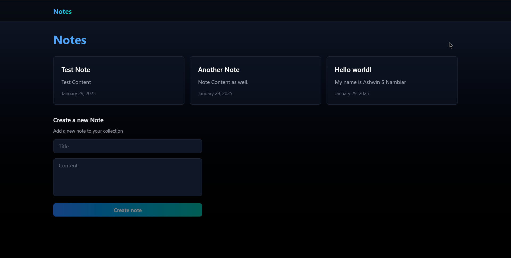
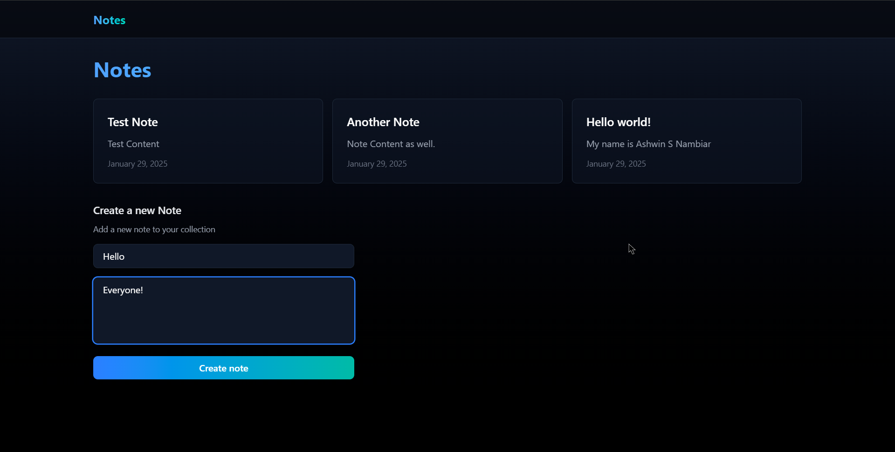
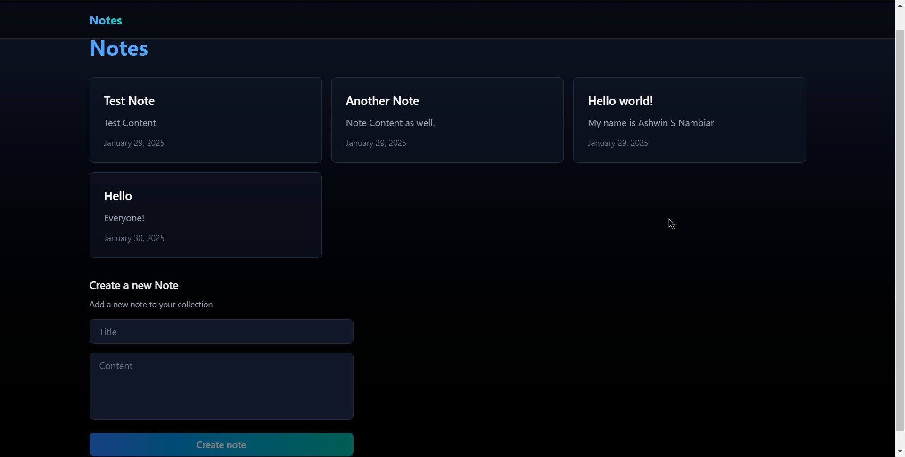
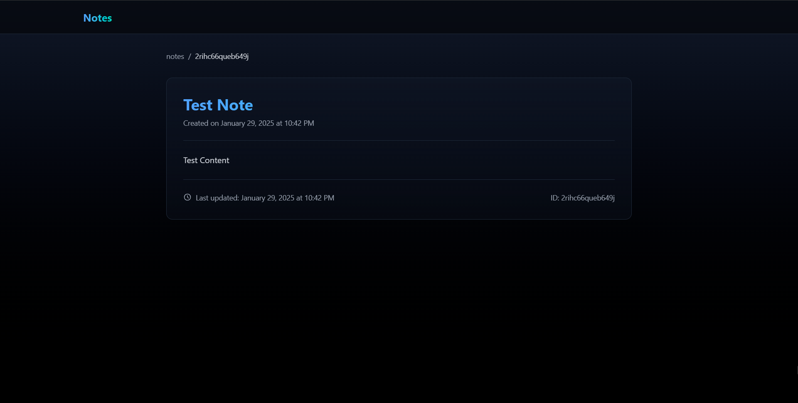
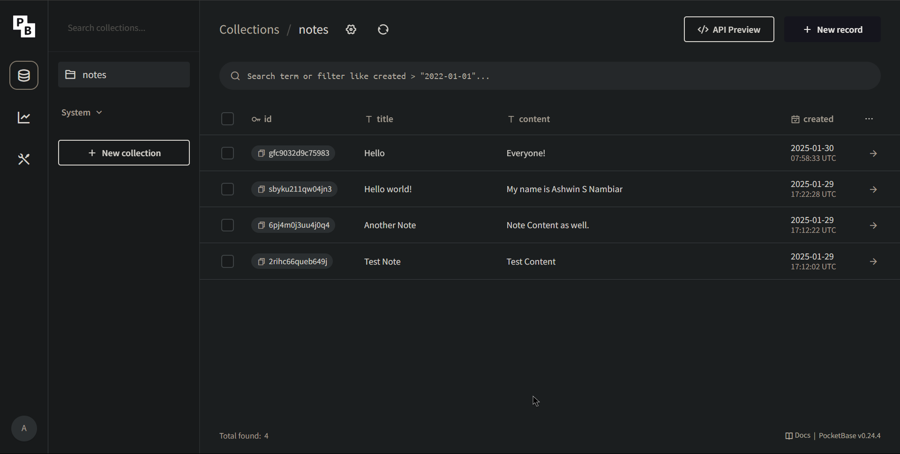
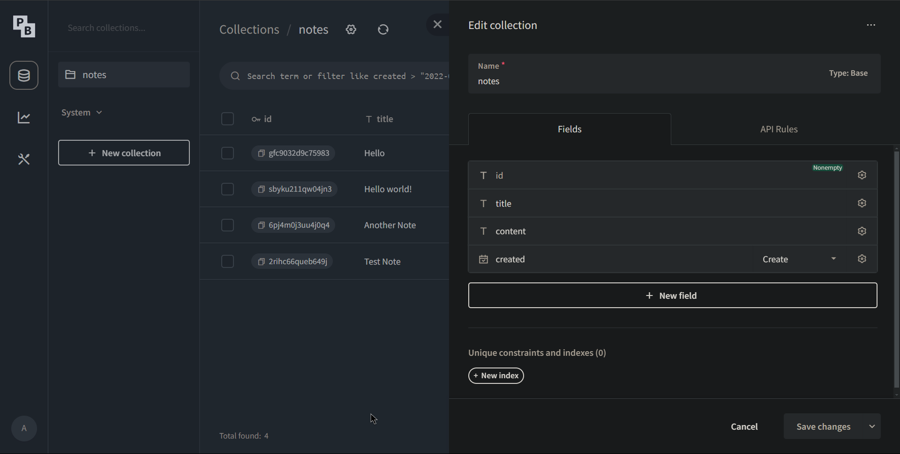

# 🗒️ Notes App

***A full-stack app made using Next.js with TypeScript. Built to better understand Next.js and full-stack development. Uses PocketBase for backend, so can only run locally for the moment. More improvements coming soon.***

## 🛠️ Tech Stack

- **Next.js - For building the app.**
- **TypeScript - For static typing.**
- **TailwindCSS - For theming and styling purposes.**
- **[PocketBase](https://pocketbase.io/docs/) - For API call / backend.**

## ✨ Installation / Running

1. **Clone the repo to your PC.**
2. **Run `npm i && npm run dev` in the terminal to install the dependencies and to run the app.**
3. **Go to [PocketBase](https://pocketbase.io/docs/) and download the `pocketbase.exe` file for your operating system.**
4. **After adding the `pocketbase.exe` file to your root folder in your ptoject, run `./pocketbase serve`.**
5. **This will run the server and ask you to create a new collection and to create records accordingly. The API point will be at `http://localhost/api/` to access the data.**
6. **Congrats!!, you have completed the intialization for the app and can continue with the changes you intend to do.**

## 📸 Screenshots

    <h3>Landing Page</h3>
    

    <h3>Adding a New Note</h3>
    

    <h3>Showing the New Note in Home Page</h3>
    

    <h3>Note Details Page</h3>
    

    <h3>PocketBase Backend</h3>
    

    <h3>PocketBase Backend Structure</h3>
    

## 🧔‍♂️ Author
**Ashwin S Nambiar**
